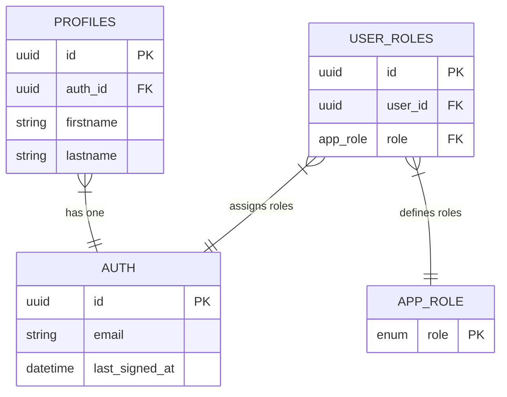

## Modèle de données

```mermaid
erDiagram
    PROFILES {
        uuid id PK
        uuid auth_id FK
        string firstname
        string lastname
    }

    APP_ROLE {
        enum role PK
    }

    USER_ROLES {
        uuid id PK
        uuid user_id FK
        app_role role FK
    }

    AUTH {
        uuid id PK
        string email
        datetime last_signed_at
    }

    PROFILES }|--|| AUTH: "has one"
    USER_ROLES }|--|| AUTH: "assigns roles"
    USER_ROLES }|--|| APP_ROLE : "defines roles"
```
