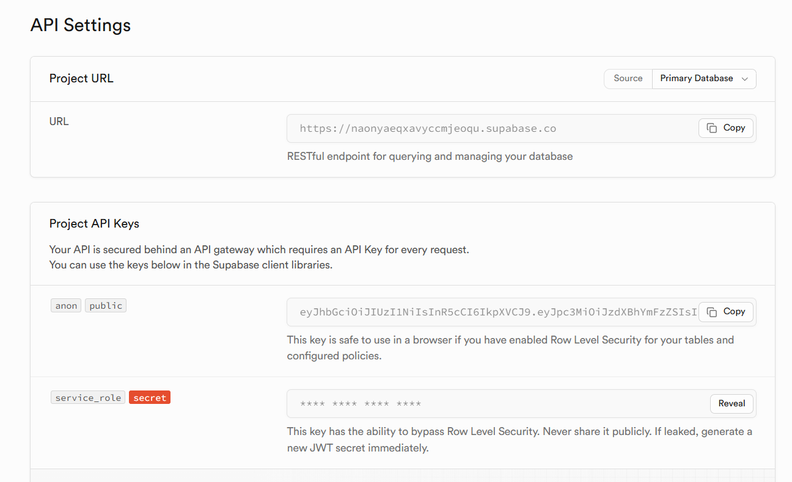

## Installation & Configuration

### Node

- version de Node : `20`
- gestionnaire de dépnedances : `yarn`

### Supabase

Se créer un compte dans supabase, et récupérer les informations suivantes :



### Création des base de données

Exécuter dans l'ordre les requêtes `SQL` du dossier [supabase](../supabase/).

### Initialisation des données

**TODO**

### Variables d'environnement

- back
 
```env
CORS_ORIGINS=http://localhost:9000
SUPABASE_URL=https://my.supabase.co
SUPABASE_SERVICE_ROLE=321.321.321
```

- front
 
```env
BASE_URL=http://localhost:3000
FRONT_URL=http://localhost:9000
SUPABASE_URL=https://my.supabase.co
SUPABASE_KEY=123.123.123
```